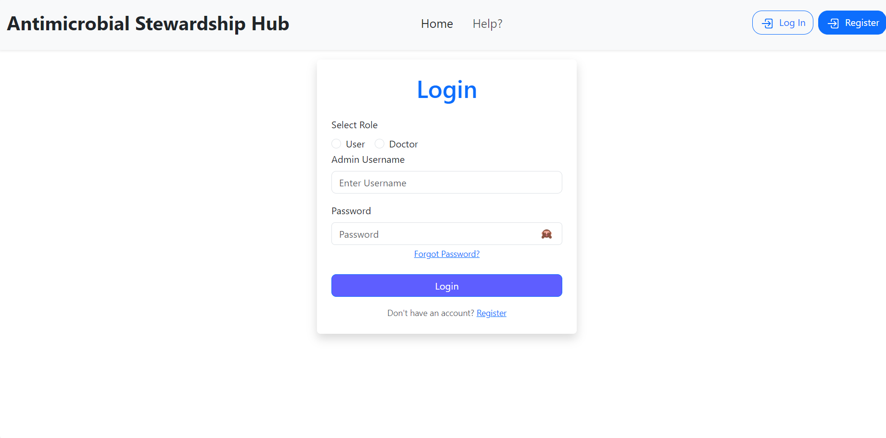
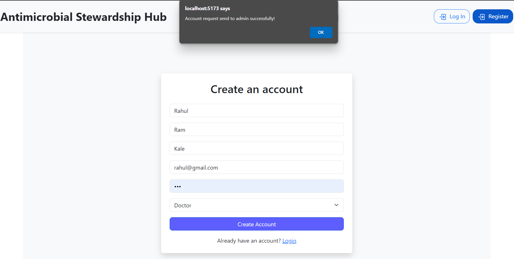
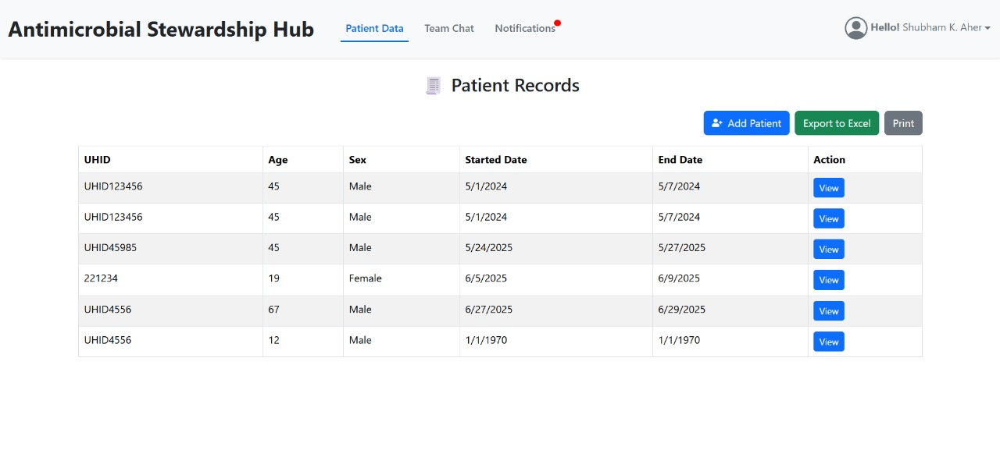
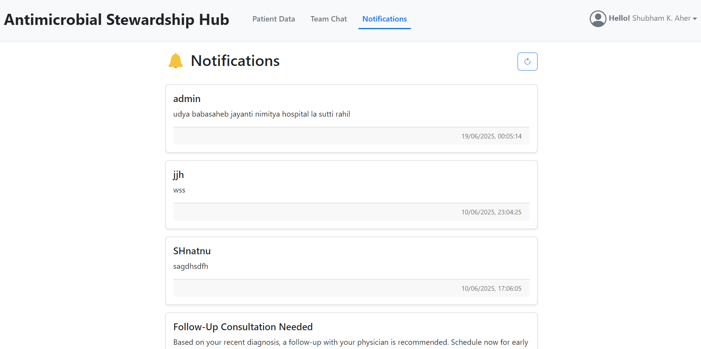
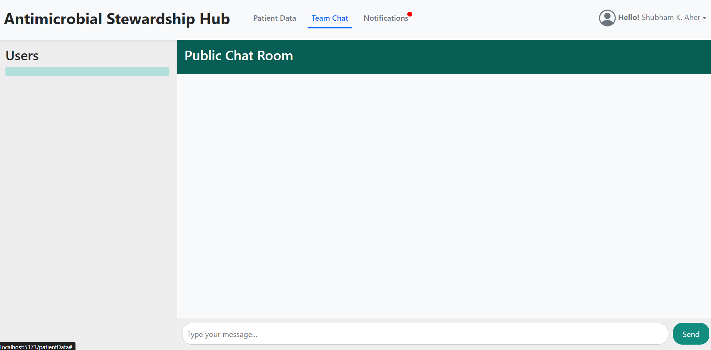
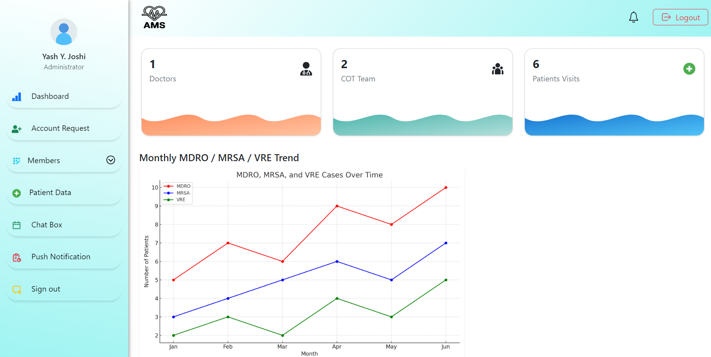
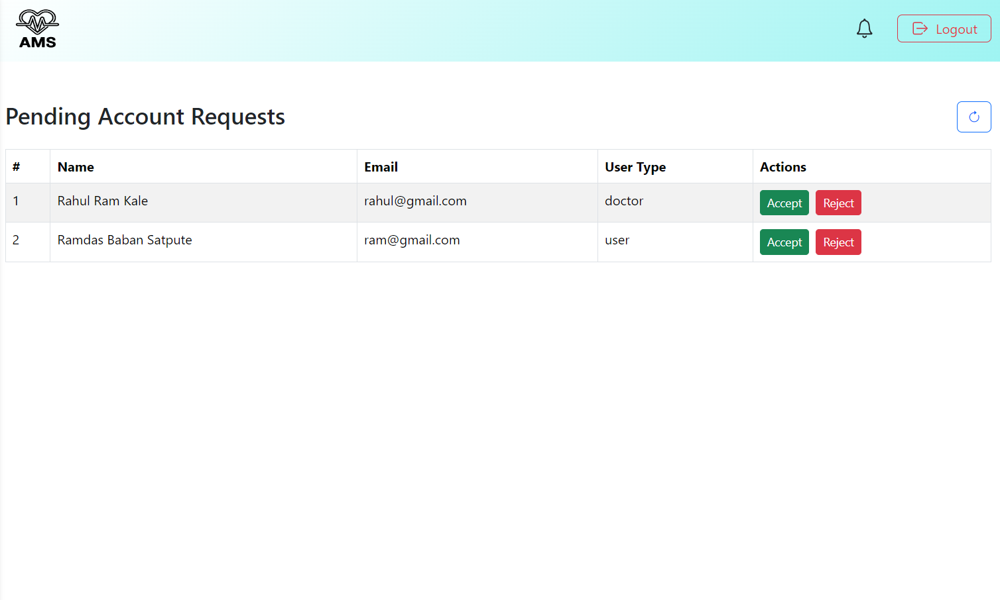
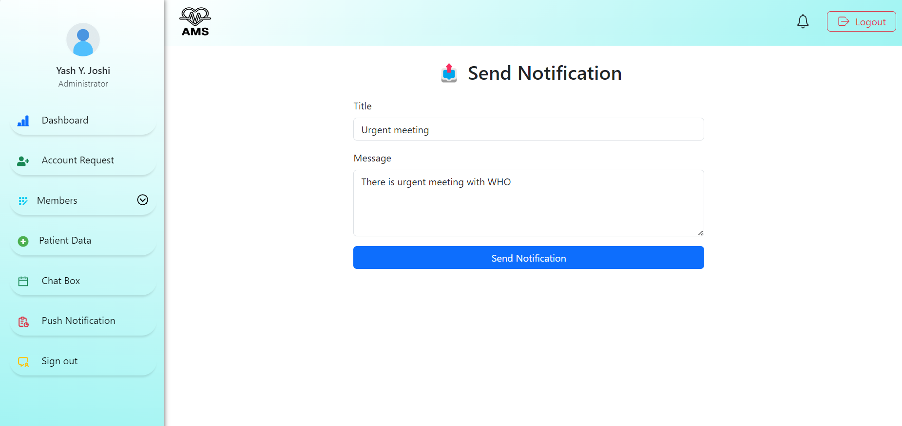

# 🦠 Antimicrobial Stewardship System (AMS)

The **Antimicrobial Stewardship System** (AMS) is a MERN-based healthcare project designed to support the effective monitoring and management of antimicrobial use in hospitals or clinical environments. The goal is to **promote the appropriate use of antimicrobials**, improve patient outcomes, reduce microbial resistance, and decrease unnecessary costs.

---

## 🚀 Features

- 🔐 Role-Based Login System (Admin, Doctor, COT team, etc.)
- ✅ Admin Approval for New User Registration
- 🔄 OTP-Based Password Reset System
- 💬 Real-Time Chat between Users and Doctors (via Socket.IO)
- 📦 MongoDB Atlas Integration
- 📥 Admin Push Notification System (Firebase)
- 📊 Dashboard with Insights for Admin and Doctors
- 🗂️ Account Request Handling by Admin
- 🧠 Easy-to-use Interface for Managing Stewardship Activities

---

## 🔴 Live Demo

🌐 [Click here to see live demo](https://your-demo-url.com)  
_Replace with your actual hosted link when ready._

---

## 🧪 Badges (Tech Stack)


---

## 📷 Screenshots

### 🔐 Login Page


### 👥 Register


### 🤒 Patient Record


### 🔔 Notification


### 💬 Realtime Chat


### 🔏 Admin Login


### 👤 Admin Dashboard


### 📩 Admin Approval Interface


### 💬 Send Notification


> 🔔 _Make sure you place actual screenshots in a `screenshots/` folder inside the root of your project._

---

## 🛠️ Tech Stack

**Frontend:**  
- React.js  
- React Bootstrap  
- Axios  
- React Router DOM  
- Firebase for Notifications  

**Backend:**  
- Node.js  
- Express.js  
- MongoDB Atlas  
- Mongoose  
- JWT for Authentication  
- bcrypt for Password Hashing  
- Socket.IO for Chat Functionality  

---

## 🔧 Installation

### 1. Clone the Repository

```bash
git clone https://github.com/your-username/ams-project.git
cd ams-project
